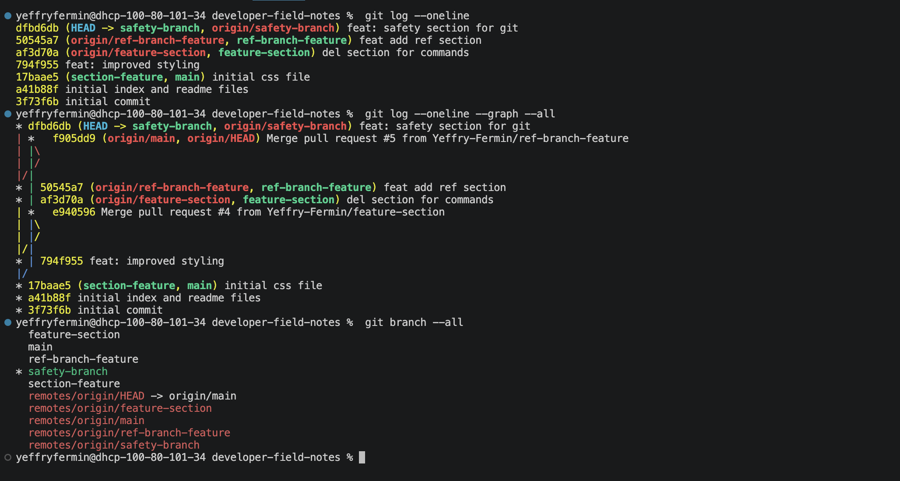

 Project name.
Short description.
Link to the deployed GitHub Pages site.
List of features.
One thing you learned about Git.

# Git Solo Workflow 

--This project serves as a way to get familiar with the inner workings of git.

--https://github.com/Yeffry-Fermin/Git-Solo-Workflow

--Nothing noteworthy

--I learned how to do basic branching, how to open up issues, merge a branch with your main codebase to close issues. 

# Notes 

